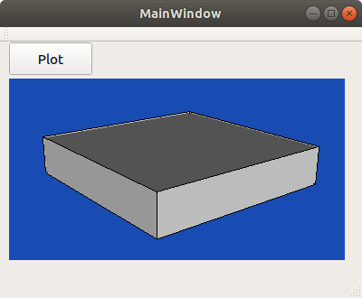
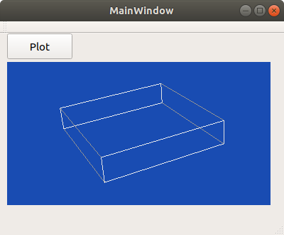

This is a minimalistic example of QT + VTK rendering a cylinder upon clicking a button.

# Compilation
- create a folder build `mkdir build`
- go into build
- type `cmake ..`
- type `make`
- the executable `test.out` will be created in bin

# Running the code

May need to explicitly specify the path to the QT libs:

```LD_LIBRARY_PATH="/opt/Qt5.9.0/5.9/gcc_64/lib" ./test.out```


# Result





