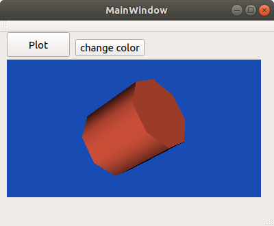

# Qt + VTK examples

I wrote these minimalistic examples to learn more about Qt and VTK myself and decided to share these examples with others. Many of these examples are my own 'experiments', and therefore they may not be written in the most efficient way, rather they demonstrate how things can be done.

The examples currently include:

QTVTK-box-OpenGL |  QTVTK-cylinder | VTK-vector-field-on-unstructured-grid
:-------------------------:|:-------------------------:|:-------------------------:
 |  | 

